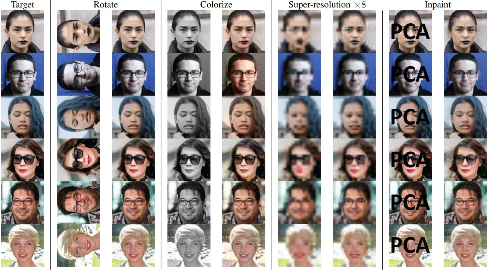

## Linear (Un)supervised Image-to-Image Translation


*Examples for linear orthogonal transformations in PCA domain, learned without pairing supervision. Training time is about 1 minute.*

This repository contains the official pytorch implementation of the following paper:

> **The Surprising Effectiveness of Linear Unsupervised Image-to-Image Translation**<br>
> Eitan Richardson and Yair Weiss<br>
> https://arxiv.org/abs/2007.12568
>
> **Abstract:** *Unsupervised image-to-image translation is an inherently ill-posed problem. Recent methods based on deep encoder-decoder architectures have shown impressive results, but we show that they only succeed due to a strong locality bias, and they fail to learn very simple nonlocal transformations (e.g. mapping upside down faces to upright faces). When the locality bias is removed, the methods are too powerful and may fail to learn simple local transformations. In this paper we introduce linear encoder-decoder architectures for unsupervised image to image translation. We show that learning is much easier and faster with these architectures and yet the results are surprisingly effective. In particular, we show a number of local problems for which the results of the linear methods are comparable to those of state-of-the-art architectures but with a fraction of the training time, and a number of nonlocal problems for which the state-of-the-art fails while linear methods succeed.*

### TODO:
- [X] Code for reproducing the linear image-to-image translation results
- [ ] Code for applying the linear transformation as regularization for deep unsupervisd image-to-image (based on ALAE)
- [ ] Support for user-provided dataset (e.g. image folders)
- [ ] Automatic detection of available GPU resources

## Requirements

* Pytorch (tested with pytorch 1.5.0)
* faiss (tested with faiss 1.6.3 with GPU support)
* OpenCV (used only for generating some of the synthetic transformations)

## System Requirements

Both the PCA and the nearest-neighbors search in ICP are performed on GPU (using pytorch and faiss).
A cuda-enabled GPU with at least 11 GB of RAM is recommended.
Since the entire data is loaded to RAM (not in mini-batches), a lot of (CPU) RAM is required as well ...

## Code structure

* [run_im2im.py](run_im2im.py): The main python script for training and testing the linear transformation
* [pca-linear-map.py](pca-linear-map.py): The main algorithm. Performs PCA for the two domains, resolves polarity ambiguity and learnes an orthogonal or unconstrained linear transformation. In the unpaired case, ICP iterations are used to find the best correspondence.
* [pca.py](pca.py): Fast PCA using pytorch and the skewness-based polarity synchronization.
* [utils.py](utils.py): Misc utils
* [data.py](data.py): Loading the dataset and applying the synthetic transformations

## Preparing the datasets

The repository does not contain code for loading the datasets, however, the tested datasets were loaded in their standard format.
Please download (or link) the datasets under `datasets/CelebA`, `datasets/FFHQ` and `datasets/edges2shoes`.

## Learning a linear transformation

```
usage: run_im2im.py [--dataset {celeba,ffhq,shoes}]
                    [--resolution RESOLUTION]
                    [--a_transform {identity,rot90,vflip,edges,Canny-edges,colorize,super-res,inpaint}]
                    [--pairing {paired,matching,nonmatching,few-matches}]
                    [--matching {nn,cyc-nn}]
                    [--transform_type {orthogonal,linear}] [--n_iters N_ITERS]
                    [--n_components N_COMPONENTS] [--n_train N_TRAIN]
                    [--n_test N_TEST]
```

Results are saved into the `results` folder.

Command example for generating the colorization result in the above image (figure 9 in tha paper):

```
python3 run_im2im.py --dataset ffhq --resolution 128 --a_transform colorize --n_components 2000 --n_train 20000 --n_test 25
```
```
Loading matching data for ffhq - colorize ...
100%|██████████████████████████████████████████████████████████████████████████| 20000/20000 [00:04<00:00, 4549.19it/s]
100%|█████████████████████████████████████████████████████████████████████████████████| 25/25 [00:00<00:00, 299.33it/s]
Learning orthogonal transformation in 2000 PCA dimensions...
Got 20000 samples in A and 20000 in B.
PCA A...
PCA B...
Synchronizing...
Using skew-based logic for 1399/2000 dimensions.
PCA representations:  (20000, 2000) (20000, 2000) took: 68.09504985809326
Learning orthogonal transformation using matching sets:
Iter 0: 4191 B-NNs / 1210 consistent, mean NN l2 = 1308.520. took 2.88 sec.
Iter 1: 19634 B-NNs / 19634 consistent, mean NN l2 = 607.715. took 3.46 sec.
Iter 2: 19801 B-NNs / 19801 consistent, mean NN l2 = 204.487. took 3.49 sec.
Iter 3: 19801 B-NNs / 19801 consistent, mean NN l2 = 204.079. Converged - terminating ICP iterations.
Applying the learned transformation on test data...
```

## Limitations

As described in the paper:
* If the true translation is very non-linear, the learned linear transformation will not model it well.
* If the image domain has a very complex structure, a large number of PCA coefficients will be required to achieve high quality reconstruction.
* The nonmatching case (i.e. no matching paires exist) requires larger training sets.
